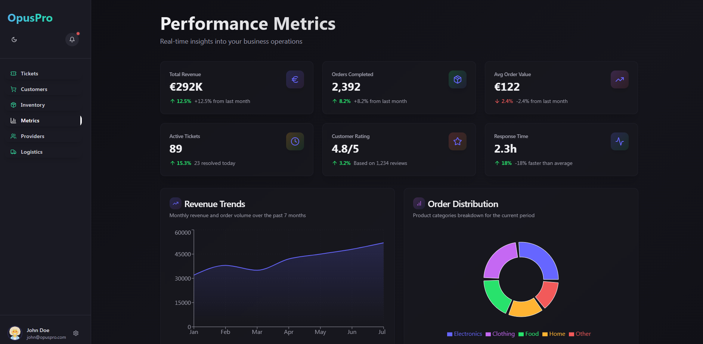
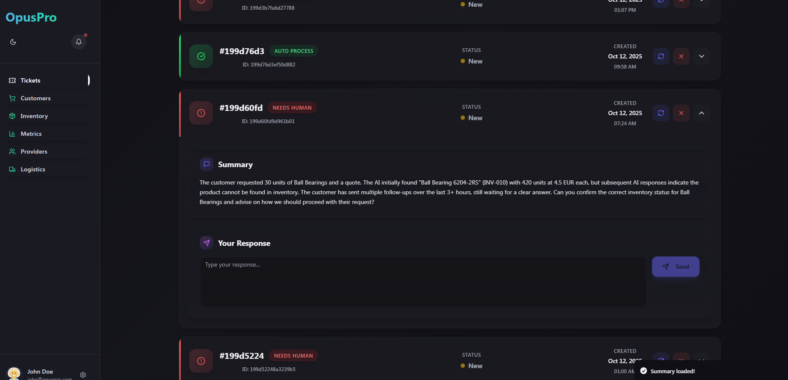

# OpusPro

OpusPro is an AI-powered dashboard for manufacturing companies to manage customers, providers, and logistics. It simplifies complex processes through an easy-to-use interface and powerful automation.

## About The Project

This project is designed to streamline manufacturing operations by providing a centralized platform for managing key business data. It leverages AI and workflow automation to reduce manual effort and improve efficiency. With OpusPro, you can easily track inventory, manage supplier information, and get insights into your business performance.

A key feature of the project is its ability to process PDF documents, extracting valuable data and integrating it into your workflows. This is powered by a robust backend that communicates with n8n for workflow automation.

## Key Features

- **AI-Powered Dashboard:** A central hub for managing customers, providers, and logistics.
- **PDF Processing:** Automatically extract data from PDF documents like invoices and reports.
- **Workflow Automation:** Using n8n to automate repetitive tasks and streamline processes.
- **Customer and Provider Management:** Keep track of all your business contacts in one place.
- **Inventory and Logistics Tracking:** Monitor your inventory levels and logistics operations.

## Screenshots


_Metrics Dashboard_


_Ticket Summary_

## Technologies Used

### Frontend

- **React:** A JavaScript library for building user interfaces.
- **TypeScript:** A typed superset of JavaScript that compiles to plain JavaScript.
- **Vite:** A fast build tool for modern web development.
- **Tailwind CSS:** A utility-first CSS framework for rapid UI development.
- **Shadcn/ui:** A collection of reusable UI components.
- **Lovable:** Used for frontend development.

### Backend & Automation

- **Python:** Used for various backend scripts, including data processing and API interactions.
- **n8n:** A workflow automation tool to connect different services and APIs.
- **Weaviate:** A vector database for inventory query.
- **Redis:** In-memory data store.
- **GitLab CI/CD:** For continuous integration and deployment.

### Data Processing

- **PDF Processing:** Scripts for extracting data from PDF files.
- **CSV Data Management:** Handling of business data stored in CSV files.

## External Services

- **Landing.ai:** For scanning and parsing PDFs to an LLM.
- **APITemplate.io:** For PDF generation.

## Getting Started

To get a local copy up and running, follow these simple steps.

### Prerequisites

- Node.js and npm
- Python 3

### Installation

1.  **Clone the repo**
    ```sh
    git clone https://github.com/your_username_/OpusPro.git
    ```
2.  **Install NPM packages**
    ```sh
    cd frontend
    npm install
    ```
3.  **Install Python packages**
    ```sh
    pip install -r requirements.txt
    ```

### Running the Application

1.  **Start the frontend development server**
    ```sh
    cd frontend
    npm run dev
    ```
2.  **Run the backend scripts**
    The Python scripts in the `python_scripts` directory can be run individually. For example, to run the `pdf_generator.py` script:
    ```sh
    python python_scripts/pdf_generator.py
    ```

## n8n Workflows

The `n8n/workflows` directory contains the JSON files for the n8n workflows used in this project. You can import these workflows into your n8n instance to automate various tasks. The available workflows are:

- `get_ticket_summary.json`
- `manager_message.json`
- `pdf_generator.json`
- `user_email_query.json`

## License

Distributed under the MIT License. See `LICENSE` for more information.
